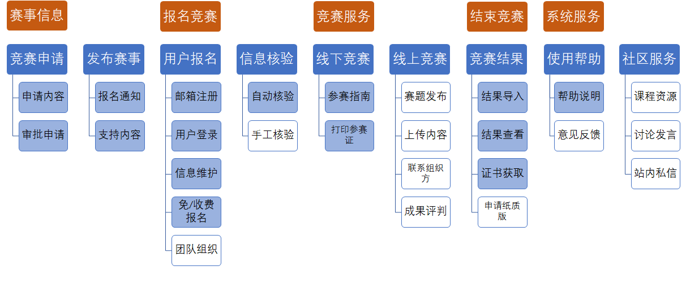

## "Contest+"  产品定义与故事

J01组

### 产品定义

#### 产品定位

中国高校计算机大赛是由多部门主办、面向全球高校学生的高水平计算机类系列竞赛，包含多个模块。

本产品主要面向大赛的 “大数据挑战赛” 和 “微信小程序开发赛” 两个模块，提供一个覆盖赛事全流程的竞赛服务平台，能够支持竞赛信息发布、选手报名、在校身份验证以及电子获奖证书自动生成和领取等功能，为组织竞赛与参加竞赛提供支持。

#### 干系人分析

##### 竞赛工作人员

- 来源简单，负责竞赛的事务性工作（包括赛事信息发布、报名人员核验、纸质证书发放等）；
- 有一定的竞赛组织经验，熟悉竞赛流程；
- 对自动化办公有一定需求。

##### 参赛人员

- 高校在校学生，来源复杂，可能存在国外高校学生；
- 一般具有各类互联网产品的使用经验；
- 可能不具有参加竞赛的经验，不了解竞赛流程；
- 有获取获奖证书的需求。

##### （可能存在的）竞赛评委

- 线上竞赛可能需要评委使用竞赛服务平台直接评分；
- 有一定 Web 应用使用经验；
- 对参赛作品的内容获取、阅读与展示的便捷性、可靠性有要求。

#### 痛点与解决方案

- 中国高校计算机大赛已成为吸引众多大学生参加的重要竞赛活动，但竞赛要求对选手身份进行赛前校验，手工核验工作量大、且不能保证核验的准确性，无法有效确认参赛人员的参赛资格。

    本产品计划使用自动与手动核验两种方式。自动核验使用学信网平台的学籍在线验证系统，主要针对大部分报名参赛的大陆高校在校学生；手动核验供无法使用学信网平台的高校在校生使用，报名者上传学生证照片等相关材料、由工作人员进行手动审核。

- 竞赛活动结束后，发放获奖证书工作量很大，手工制作极易出错，同时也缺少防伪机制等。

    本产品计划开发自动生成电子版获奖证书的功能，使获奖的参赛人员可自助获取电子证书，同时附有防伪校验信息。如需获取纸质版证书，也可通过在线申请，由工作人员导出电子版证书打印并寄出。

#### 产品目标

- 为竞赛工作人员提供竞赛信息发布功能，可以汇总竞赛信息便于参赛人员查看。
- 为欲报名参赛人员提供注册、身份核验等功能，身份核验分学信网自动核验与工作人员手动核验两种方式。
- 为参赛人员提供参赛指南、通知提醒等功能，包括竞赛的线下部分的详细指南。
- 【可选】为线上组织的竞赛提供系统支持，可以在平台完成全流程的竞赛活动（包括打分、评级等）。
- 竟赛结束后支持工作人员导入成绩信息并发布获奖情况。
- 参赛人员可查看获奖情况、自行获取附有校验信息的电子版证书，也可申请纸质版证书。

#### 产品愿景

- 整合竞赛相关信息，提供全面的竞赛流程服务，降低参赛人员获取信息的成本和负担。
- 减轻工作人员核验报名者的工作压力、同时通过学信网等平台的学籍信息服务，提高核验的准确性，有效防止无资格人员参赛。
- 减轻工作人员手动制作获奖证书的工作压力，同时便利获奖人员获取与保存电子版证书。

### 用户故事

#### 用户故事地图

（白色块为优先级较低的用户故事 / 需求。）

#### 具体用户故事

##### 发布赛事

- 报名通知

    作为竞赛工作人员，可以发布竞赛的报名通知，以便于欲报名参赛者获取信息。

- 支持内容

    作为竞赛工作人员，可以发布竞赛所需的文档、软件、数据等内容，以便于参赛者集中获取。

    

##### 用户报名

- 邮箱注册

    - 作为用户，可以通过邮箱注册，以便于开展后续流程。
    - 考虑后续如开发微信小程序等，可直接使用其账号系统。
- 用户登录

    - 作为用户，可以通过 Web 页面登录，以便于开展后续流程。
    - 考虑后续如开发微信小程序等，可保持登录状态。
- 信息维护

    - 作为用户，可以维护个人信息，以简化后续竞赛可能需要采集个人信息的步骤。
    - 【可选】作为参赛人员，可以维护组队信息和辅导老师信息，以组队参赛并补充相关信息。
- 免 / 收费报名
    - 作为用户，可以通过平台报名竞赛，以便于参加后续竞赛流程。
    - 考虑竞赛如有收费需求，引入某些支付平台（可能存在资质问题难以开展）。

##### 信息核验

- 自动核验

    作为报名参赛人员，可以通过提交学信网校验内容自动核验个人学籍信息，以便于快速认证竞赛资格。

- 手工核验

    - 在用户无法自动核验时，可通过提交学生证照片等方式申请手工核验。
    - 作为竞赛工作人员，可以审核报名人员提交的手工核验内容，以解决特殊用户的认证需求。

##### 线下竞赛

- 参赛指南

    作为参赛人员，可以获取线下竞赛的相关信息，以便于其按要求参加竞赛。

- 打印参赛证

    作为参赛人员，可以打印线下竞赛所需的参赛证，以证明参赛资格。

##### 线上竞赛

- 赛题发布

    作为竞赛工作人员，可以发布线上竞赛可能需要补充的赛题信息，以开展竞赛。

- 上传内容

    作为参赛人员，可以上传竞赛作品、文档等内容，以完成竞赛内容。

- 联系组织方

    作为参赛人员，可以就线上竞赛的疑问联系组织人员，以顺利完成竞赛。

- 成果评判

    作为竞赛评委，可以在竞赛服务平台直接对参赛作品进行评价，以便于发布竞赛结果。

##### 竞赛结果

- 结果导入

    - 作为竞赛工作人员，可以通过平台逐个为参赛人员给出成绩，以便于发布竞赛结果。
    - 作为竞赛工作人员，可以通过上传结果文件的方式录入成绩，以便于发布竞赛结果。

- 结果查看

    作为参赛人员，可以查看竞赛结果，以确定奖项。

- 证书获取

    作为获奖人员，可以获取电子版证书，以证明参赛成绩。

- 申请纸质版

    作为获奖人员，可以申请纸质版证书，以证明参赛成绩。

##### 使用帮助

- 帮助说明

    作为用户，可以查看系统帮助，以便于使用竞赛服务平台。

- 意见反馈

    作为用户，可以通过反馈系统表达意见与建议，以便于平台改进服务。