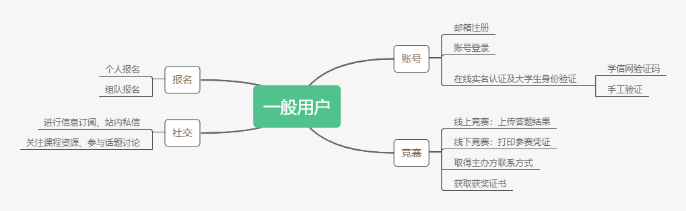
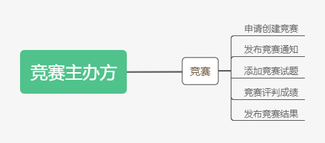

# 2 综合描述

> J01组 撰写人：周彦如

### 2.1 产品前景

现今有许多面向高校在校学生的大赛在我国举办。但是现有大赛平台的在校身份验证多采手工验证，效率极低。同时当竞赛参与人数多时，结束后获奖证书的发放工作量也很大。本产品为一个竞赛服务平台，提供参赛用户的竞赛报名、在校身份验证及获奖后带防伪功能的电子获奖证书领取，也支持竞赛举办方进行竞赛信息发布。

Contest+项目团队汲取市面上现有竞赛服务平台的优点如一站式服务、增值功能等，并改善页面逻辑混乱、身份验证等功能，以期为高校在学学生提供一个能够替代现有产品的全新竞赛服务产品。

### 2.2 产品功能

根据产品目的，Contest+提供了以下功能：

##### 一般用户：

1. 用户可通过邮箱注册账号。
2. 用户可通过有效账号登录系统。
3. 用户可通过学信网在线验证码进行实名及大学生身份验证。
4. 用户如无法通过学信网验证，可申请手工验证。
5. 用户可以报名参加赛事。
6. 用户可以组队报名参加赛事。
7. 针对线上竞赛，参赛用户可以上传个人答题内容。
8. 针对线下竞赛，用户可以打印参赛凭证与参赛须知。
9. 参赛用户可以获取竞赛举办方的联系方式，或在站内直接联系。
10. 获奖用户可以获取荣誉证书。
11. 注册用户可以进行信息订阅、站内私信。
12. 注册用户可以关注各类课程资源、参与话题讨论。

##### 具有竞赛举办权限的用户：

1. 具有竞赛举办权限的用户可以申请创建竞赛活动。
2. 管理竞赛的用户可以发布竞赛通知。
10. 管理竞赛的用户可以为线上竞赛添加试题。
13. 举办赛事的用户可以对竞赛评判成绩。
14. 举办竞赛的用户可以发布成绩。

各功能内的细项详列在第三部分的功能需求中。

### 2.3 用户特征

特征：

1. 参赛用户：具有较高学历的高校生，并且高校生用户身份繁杂，包含国内生源、港澳台学生、留学生等。
   * 希望能够在一个网站上较方便地浏览当前开展的赛事信息，并对有兴趣的竞赛进行进一步的详细信息确认。
   * 希望可以在确认竞赛内容后利用此产品方便地完成报名，并且后续也能够利用此服务网站进行作品提交、赛事动态确认等。
   * 希望可以查询到个人参赛及证书记录。
2. 竞赛主办方：竞赛主办方大多是较大型的教育或企业机构。
   * 希望能方便地发布支持自定义项的赛事信息，并完成对赛事的全过程管理，包含赛事开始前的宣传设置、赛事中的动态消息的发布，以及赛事后的数据沉淀。

经验：

1. 用户对于数码产品的使用有一定经验。
2. 用户熟悉对浏览器和微信小程序的基本操作。
3. 用户具备一定水平汉语能力。

### 2.4 一般性限制

##### 用户要求：

1. 产品开发周期大约为2-3个月。

##### 法律法规限制：

1. 需要保障用户的私密信息不外露。

##### 经费限制：

1. 项目没有额外经费，不可外包。

##### 可利用资源限制：

1. 本产品只有一台服务器。

根据上面的客观限制，我们在实现上也会有部分限制。

##### 实现限制：

实现上，本产品的形式主要有浏览器网页和微信小程序两种。

对于网页部分，实现上采前后端分离，程序栈包括：

1. 前端：	
   * Web框架：Vue 框架
   * UI组件：Vuetify 组件框架
   * 接口测试平台：YApi 接口管理平台
   * IDE：Visual Studio Code
   * 设计上力求简洁美观、导引清楚、以用户为中心
2. 后端：
   * 编程语言：Python 语言
   * Web 框架：Django 框架
   * IDE：PyCharm
   * 设计上需要符合RESTful api接口规范
   * 在传输时必须对用户敏感信息加密

数据库我们选择使用开源的 MySQL。MySQL 为关系型数据库，操作方便、维护上也较易理解，但其限制为高并发下IO压力大。同时基于对用户敏感信息的保护，我们必须对信息进行加密。

后续开发的微信小程序技术栈含JavaScript, WXML（微信标记语言）, WXSS等。

### 2.5 假设和依赖

假设：

1. 产品功能设计符合用户需求。若不符合最需要增改功能接口并且在前端进行相应的调整。
2. 由于需要传输用户的敏感信息，传输协议选择https保证传输过程的安全性。如果域名申领或https证书下发有问题则需要改成使用http传输，并且需要撰写算法对传输信息进行单向加密。

依赖：

1. 产品依赖学信网的API进行用户实名认证及高校生身份验证。
2. 后续若打算发布微信小程序，依赖微信小程序审核结果。

